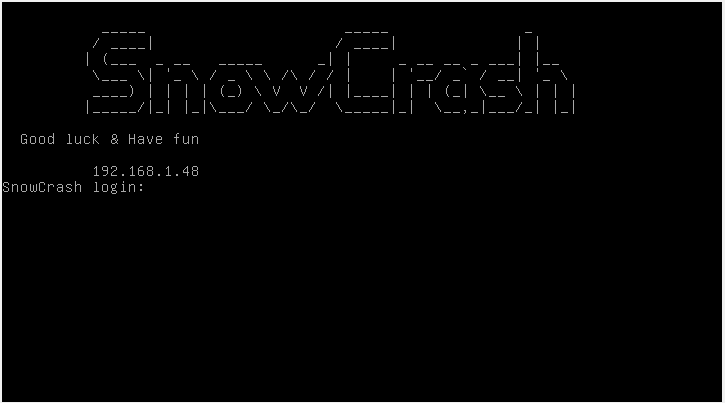

# Snow Crash: An Introduction to Cybersecurity 🛡️💻

**Snow Crash** is a project designed to provide a hands-on introduction to cybersecurity. Through a series of challenges, participants explore techniques used to identify and exploit vulnerabilities, gaining critical insights into secure software development. 🚀

## Key Features
- **Challenge-Based Learning** 🎯: Solve levels requiring logic, creativity, and technical skills. 🧠
- **Topics Covered** 📚: Command injection, privilege escalation, and secure file handling. 🔒
- **Environment** 🖥️: Virtual machine setup with SSH-based access for each level. 🔑

## Structure 🗂️
The repository is organized with separate folders for each challenge, including resources and explanations of solutions. 📝  
The project emphasizes understanding over brute force, requiring clear justification of each approach during evaluations.  ✅

## Let's get started
To complete this project, you will need to set up a virtual machine (VM) using VirtualBox and an ISO file.

### Prerequisites ⚙️
- **VirtualBox** installed on your system.
- **ISO file** provided with this project.

### Steps to Set Up the VM 🛠️

1. **Create a New Virtual Machine**:
   - Open VirtualBox and create a new virtual machine.
   - Select `Linux` as the type and `64-bit` or `32-bit` as the version.
   - Allocate sufficient memory and create a virtual hard disk as prompted.

2. **Attach the ISO File**:
   - Go to the **Settings** of the VM.
   - Navigate to **Storage** and attach the ISO file as a virtual optical disk.

3. **Configure Network Connection** 🌐:
	- Go to the **Settings** of the VM.
	- Navigate to **Network** (in Basic mode).
	- Switch the **NAT** Network to **Bridged Adapter**.

4. **Start the VM** 🚀:
   - Start the VM with the ISO attached.
   - If your configuration is correct, the VM will boot, and you will see a simple prompt displaying an IP address.
   
	

### Connecting to the VM via SSH 🔐

1. Connect to the VM using **SSH** (port `4242`):

	```bash
	ssh level00@<IP_ADDRESS> -p 4242
	```
	Replace `<IP_ADDRESS>` with the **IP address** shown on the VM prompt.

2. Enter **password**: 

	```
	level00@<IP_ADDRESS>'s password:
	```
	Enter **password** regarding to the level you want to connect. In this case the **password** is `level00`.  

	Output:

	```bash
	level00@SnowCrash:~$
	```
	Congratulations, you successfully connect to the SnowCrash's first level ✨